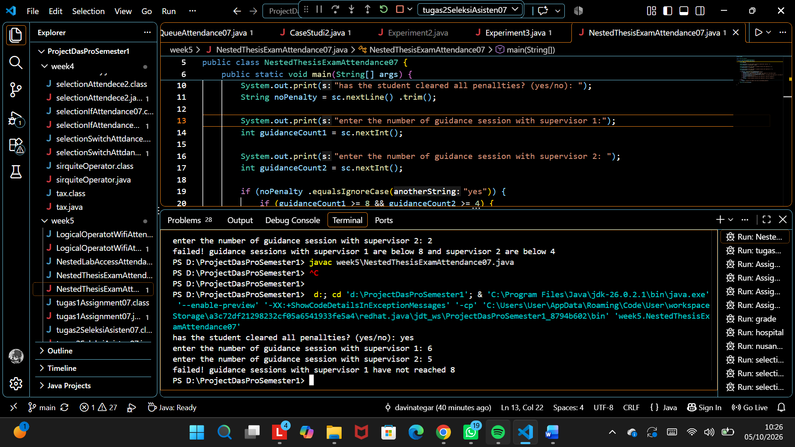
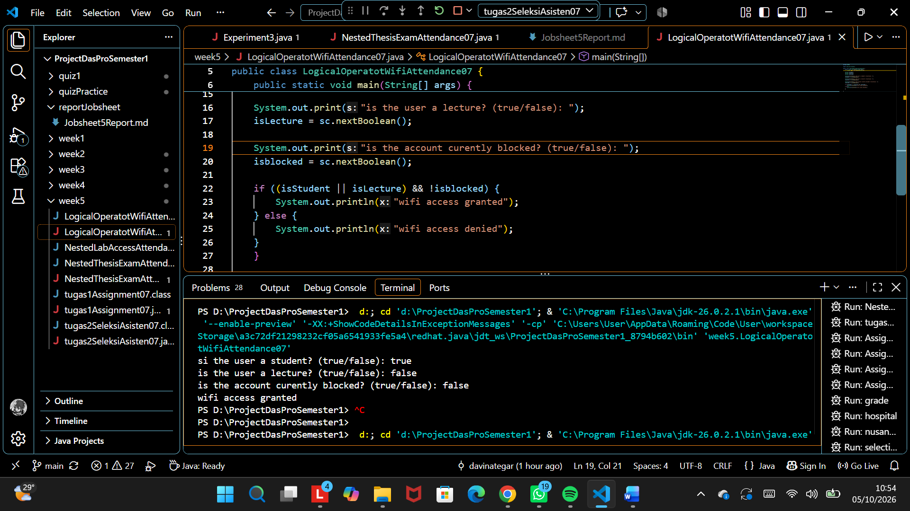
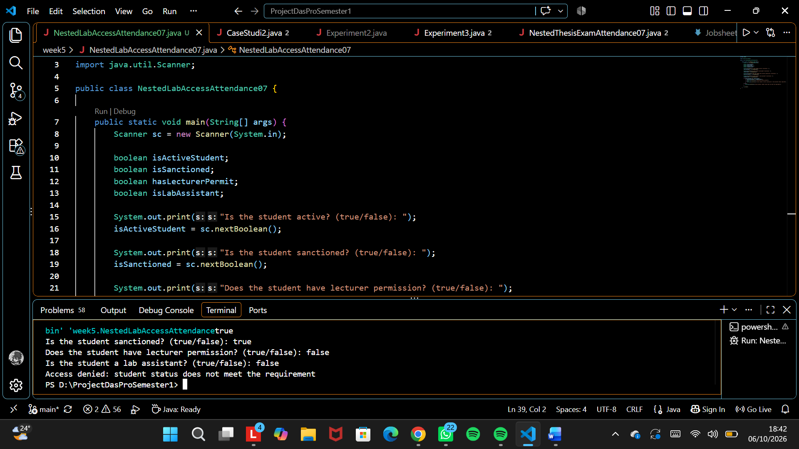
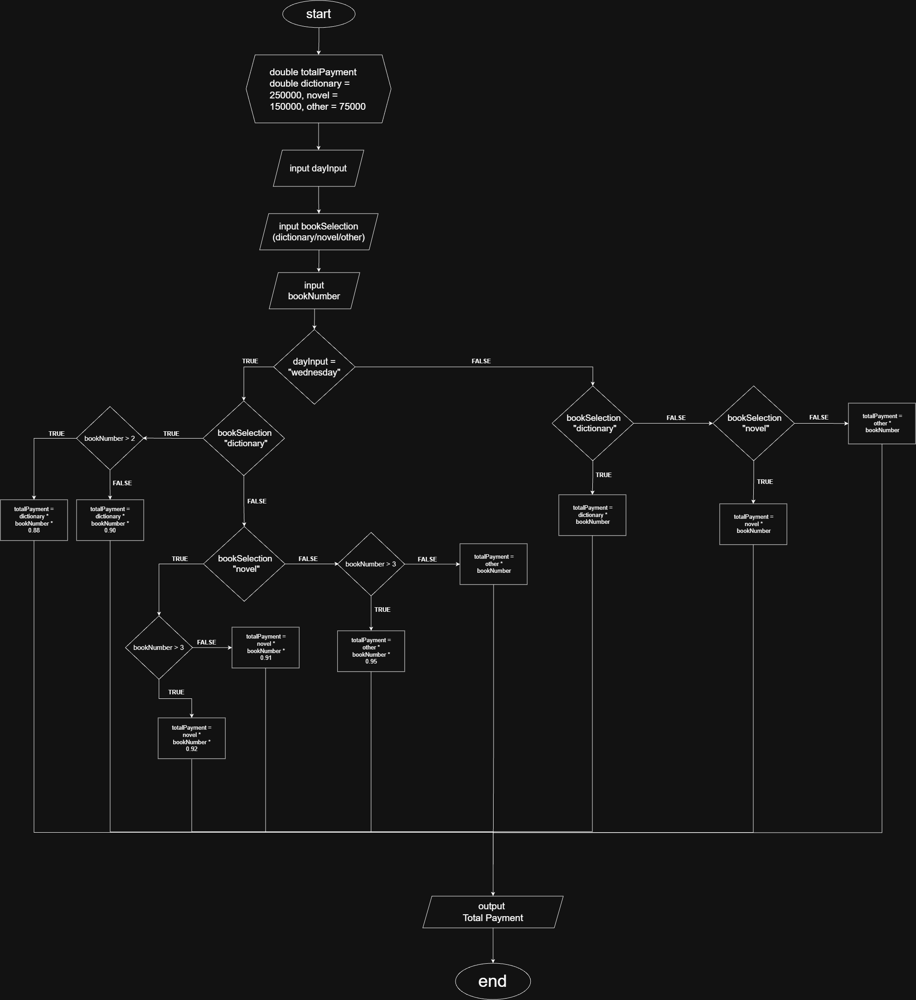
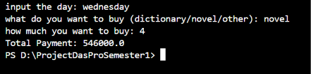
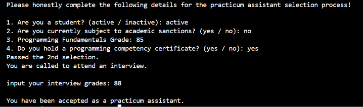

# REPORT JOBSHEET 6: SELECTION 1

Name: Davina Tegar Putri Ervia

Student ID: 246107020083

GitHub: https://github.com/davinategar

## Experiment 1:



## Answer:

**1. What happens if the student answers "No" to the penalty-clearance question? Why?**

If the student answers "No", the program goes directly to the `else` statement and displays:

`"failed! the student still has an outstanding penalty"`

**2. Explain the meaning of the following code snippet:**

`if (guidanceCount1 >= 8 && guidanceCount2 >= 4)`

This condition checks whether the student has completed the minimum number of guidance sessions with both supervisors.

  * guidanceCount1 >= 8 means the student must have at least 8 sessions with supervisor 1.
  * guidanceCount2 >= 4 means the student must have at least 4 sessions with supervisor 2.
  * && means both conditions must be true.

If both requirements are fulfilled, the program displays:

`All requirements met. The student may register for the thesis exam`

**3. Describe the full flow of checking the student's requirements from start to finish. Explain step by step for every condition.**

First, the program asks whether the student has cleared all penalties.

  * **Step 1:** If the student answers "yes", the program continues to check the guidance session requirements.
  * **Step 2:** The program checks whether the student has at least 8 guidance sessions with supervisor 1 AND at least 4 sessions with supervisor 2.

    `guidanceCount1 >= 8 && guidanceCount2 >= 4`

    If both conditions are true, the student has fulfilled all requirements and may register for the thesis exam.
  * **Step 3:** If both guidance requirements are below the minimum:
    `guidanceCount1 < 8 && guidanceCount2 < 4`

    the program states that the sessions with both supervisors are insufficient.
   * **Step 4:** If only the sessions with supervisor 1 are below 8:
     `guidanceCount1 < 8`

     the program states that the student has not reached the required 8 sessions with supervisor 1.
   * **Step 5:** Otherwise, the sessions with supervisor 2 must be below 4, so the program states that the student has not reached the required 4 sessions with supervisor 2.
   * **Step 6:** If the student answers "no" to the penalty-clearance question, the program immediately displays that the  student still has an outstanding penalty. The guidance session requirements are not considered.

## Experiment 2:



| Test | isStudent | isLecturer | isBlocked | Expected Output |
|------|-----------|------------|-----------|-----------------|
| 1 | true | false | false | WiFi access granted |
| 2 | false | true | false | WiFi access granted |
| 3 | true | false | true | WiFi access denied |
| 4 | false | false | false | WiFi access denied |

## Answer:

**1. Explain the function of the ||, &&, and ! operators.**
* `||` (OR) means at least one condition must be true.
* `&&` (AND) means all conditions must be true.
* `!` (NOT) reverses a boolean value. `!isBlocked` means the account is not blocked.

**2. Why can a lecturer still get access when isStudent = false?**

A lecturer can still get access when the condition uses `||` because only one condition needs to be true. If `isStudent` is false but `isLecturer` is true, the OR condition is still true, as long as the account is not blocked.

**3. Change || to &&. What happens?**

Test 1 and Test 2 will be denied access because `&&` requires both `isStudent` and `isLecturer` 

**4.  When does isLecturer not need to be evaluated?**

In `isStudent || isLecturer`, if `isStudent` is already true, `isLecturer` does not need to be evaluated because the OR condition is already true. This is called short-circuit evaluation.

**5. When does !isBlocked not need to be evaluated?**

In `(isStudent || isLecturer) && !isBlocked`, if `isStudent || isLecturer` is false, `!isBlocked` does not need to be evaluated because the entire AND condition will already be false.

## Experiment 3:



## Answer:

**1. Why is hasLecturerPermit || isLabAssistant placed inside the first IF?**

It is placed inside the first if because the student must first be active and not sanctioned before checking their permission to access the laboratory. After passing the first requirements, the program checks whether the student has lecturer permission OR is a lab assistant.

**2. Explain the function of the &&, ||, and ! operators in this program.**

The `&&` operator means `AND`, so all connected conditions must be true. The `||` operator means `OR`, so at least one condition must be true. The `!` operator means `NOT`, which reverses a boolean value. In this program, `!isSanctioned` means the student must not be sanctioned.

**3. Can the access requirement be written as a single condition?**

Yes. The nested `if` can be written as a single condition:

```
if (isActiveStudent && !isSanctioned &&
    (hasLecturerPermit || isLabAssistant)) {
    System.out.println("Laboratory access granted");
} else {
    System.out.println("Access denied");
}
```

The final access decision is the same, because the student must be active, not sanctioned, and either have lecturer permission or be a lab assistant.

**4. What is the advantage of using Nested IF in this case, compared to a single IF, if the system needs to show different reasons for denial?**

The advantage of using Nested IF is that the program can show different reasons for denial. For example, if the student is inactive or sanctioned, it displays:

`Access denied: student status does not meet the requirement`

If the student passes the first requirements but does not have lecturer permission or lab assistant status, it displays:

`Access denied: lecturer permission or lab assistant status required`

Therefore, Nested IF makes the reason for the denial clearer.

**5. Create one input combination that causes access to be denied at the first level, and one that causes it to be denied at the second level.**

```
isActiveStudent = false
isSanctioned = false
hasLecturerPermit = true
isLabAssistant = false
```

The access is denied because isActiveStudent is false, so the program does not enter the first if.

**Output:**

`Access denied: student status does not meet the requirement`

This shows the difference between first-level denial and second-level denial.

# Assignment:

## 1. Implement the flowchart you created in Exercise 2 of Week 6 for the bookstore discountsystem as a Java program. The program must use nested selection statements (Nested IF).Use logical operators where needed.

**FlowChart:**



**Source Code:**

```
// Source code is decompiled from a .class file using FernFlower decompiler (from Intellij IDEA).
package week5;

import java.util.Scanner;

public class tugas1Assignment07 {
   public tugas1Assignment07() {
   }

   public static void main(String[] var0) {
      Scanner var1 = new Scanner(System.in);
      double var4 = (double)250000.0F;
      double var6 = (double)150000.0F;
      double var8 = (double)75000.0F;
      System.out.print("input the day: ");
      String var10 = var1.nextLine();
      System.out.print("what do you want to buy (dictionary/novel/other): ");
      String var11 = var1.nextLine();
      System.out.print("how much you want to buy: ");
      int var12 = var1.nextInt();
      double var2;
      if (var10.equalsIgnoreCase("wednesday")) {
         if (var11.equalsIgnoreCase("dictionary")) {
            if (var12 > 2) {
               var2 = var4 * (double)var12 * 0.88;
            } else {
               var2 = var4 * (double)var12 * 0.9;
            }
         } else if (var11.equalsIgnoreCase("novel")) {
            if (var12 > 3) {
               var2 = var6 * (double)var12 * 0.91;
            } else {
               var2 = var6 * (double)var12 * 0.92;
            }
         } else if (var12 > 3) {
            var2 = var8 * (double)var12 * 0.95;
         } else {
            var2 = var8 * (double)var12;
         }
      } else if (var11.equalsIgnoreCase("dictionary")) {
         var2 = var4 * (double)var12;
      } else if (var11.equalsIgnoreCase("novel")) {
         var2 = var6 * (double)var12;
      } else {
         var2 = var8 * (double)var12;
      }

      System.out.println("Total Payment: " + var2);
   }
}
```
**Result:**



## 2. Write a Java program for a lab-assistant candidate selection system based on the followingrules:
   * a. A student may take part in the selection if their status is active and they are notcurrently under academic sanction.
   * b. If this requirement is met, the student must also meet the next requirement: a minimumgrade of 80 in Basic  Programming, or a programming competency certificate.
   * c. If both requirements are met, the student will be called for an interview. The student isaccepted as an assistant if the interview score is at least 75.
   * d. The program must show the reason if the student fails at any stage of the selection.
   * e. Use nested selection and logical operators. Save the file as `Task2AssistantSelectionAttendanceNo.java`.

**Source Code:**

```
package week5;

import java.util.Scanner;

public class tugas2SeleksiAsisten07 {
    public static void main(String[] args) {
        Scanner sc = new Scanner(System.in);

        String studentStatus, subjectSanctions, competencyCerti;
        double programmingGrade, interviewGrades;

        System.out.println("Please honestly complete the following details for the practicum assistant selection process!");

        System.out.print("\n1. Are you a student? (active / inactive): ");
        studentStatus = sc.nextLine();

        System.out.print("2. Are you currently subject to academic sanctions? (yes / no): ");
        subjectSanctions = sc.nextLine();

        if (studentStatus.equalsIgnoreCase("active")
        && subjectSanctions.equalsIgnoreCase("no")) {
            
            System.out.print("3. Programming Fundamentals Grade: ");
            programmingGrade = sc.nextDouble();

            sc.nextLine();

            System.out.print("4. Do you hold a programming competency certificate? (yes / no): ");
            competencyCerti = sc.nextLine();

            if (programmingGrade >= 80
                || competencyCerti.equalsIgnoreCase("yes")) {

                    System.out.println("Passed the 2nd selection.");
                    System.out.println("You are called to attend an interview.");
                

                    System.out.print("\ninput your interview grades: ");
                    interviewGrades = sc.nextDouble();

                    if (interviewGrades >= 75) {
                        System.out.println("\nYou have been accepted as a practicum assistant.");
                    } else {
                        System.out.println("\nYou failed! Don't give up!");
                        System.out.println("You failed because your interview score was less than 75.");
                    }
            } else {
                System.out.println("\nYou failed!");
                System.out.println(
                    "Your Programming Fundamentals score is less than 80,"
                    + "and you do not hold a programming competency certificate."
                );
            }
        } else {
            System.out.println("\nYou failed!");
            
            if (!studentStatus.equalsIgnoreCase("active")
            && subjectSanctions.equalsIgnoreCase("yes")) {
                System.out.println("You are inactive and currently subject to an academic sanction.");
            } else if (!studentStatus.equalsIgnoreCase("active")) {
                System.out.println("Your student status is inactive.");
            } else {
                System.out.println("You are currently subject to academic sanctions.");
            }
        }

        sc.close();

    }
}
```

**Result:**


